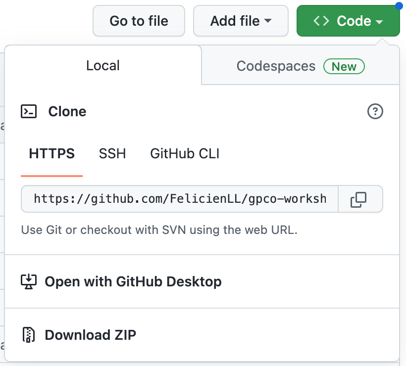
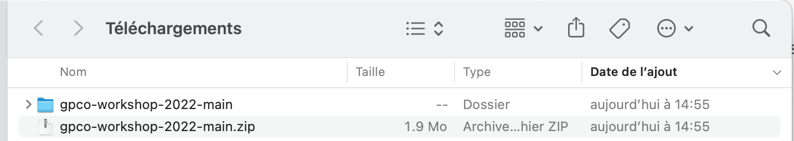

<!-- README.md is generated from README.Rmd. Please edit that file -->

# Atelier GPCO 2022

## Optimiser le STP grâce aux outils d’adaptation Bayésienne

Bonjour, sur cette page, vous trouverez les informations pour
télécharger les logiciels et les supports nécessaires pour la partie
pratique de l’atelier “Optimiser le STP grâce aux outils d’adaptation
Bayésienne”, organisé le 1er décembre 2022 par le Groupe de
Pharmacologie Clinique en Oncologie.

1.  Télécharger et installer R
2.  Télécharger et installer RStudio
3.  (ordinateur Windows uniquement) Télécharger et installer Rtools
4.  Vérifier que R, RStudio et Rtools soient correctement installés.
5.  Installer les packages necessaires à l’atelier
6.  Installer les supports necessaires à l’atelier

## 1. Telecharger et installer R

La dernière version de R publiée est la 4.2.2. Si R est déjà installé
sur votre ordinateur avec une version inférieure à 4.0 ou 4.2., il est
conseillé de vous mettre à jour au risque de (peut-être) vous retrouver
bloqué pendant l’atelier. Rendez-vous sur <https://cran.irsn.fr> et
laissez-vous guider par les instructions d’installation.

## 2. Télécharger et installer RStudio

La dernière version en date de RStudio Desktop est la 2022.07.2.
Rendez-vous sur <https://posit.co/download/rstudio-desktop/> et
laissez-vous guider par les instructions d’installation.

## 3. Télécharger et installer Rtools

Pour les utilisateurs de Windows uniquement. La version de Rtools à
installer dépend de la version de R déjà installée. Rendez-vous sur
<https://cran.r-project.org/bin/windows/Rtools/> et laissez-vous guider
par les instructions d’installation. Attention, si vous avez choisi
Rtools40 (ou inférieur), une étape manuelle est nécessaire pour
finaliser l’installation (voir les instructions d’installation).

## 4. Vérifier que R, RStudio et Rtools soient correctement installés.

- Ouvrir RStudio
- Éxecutez `R.version.string` pour afficher la version de R installée.

<!-- -->

    #> [1] "R version 4.2.2 (2022-10-31)"

- Éxecutez `Sys.which("make")` pour voir si Rtools s’est correctement
  installé. Vous devez obtenir un message du type :

<!-- -->

    #>            make 
    #> "/usr/bin/make"

ou

    #>                               make 
    #> "C:\\rtools40\\usr\\bin\\make.exe"

## 5. Installer les packages necessaires à l’atelier

Pour installer un package, il suffit d’éxecuter `install.packages()`
avec le nom du package entre guillemets. Nous aurons besoin a minima des
packages suivants:

- **tidyverse**: un ensemble de packages (dplyr, ggplot2, etc…) pour
  manipuler des données, programmer, faire des figures etc…
  `install.packages("tidyverse")`

- **mrgsolve**: package pour coder des modèles de pharmacocinétique de
  population et faire des simulations. `install.package("mrgsolve")`

- **mapbayr**: package pour faire des estimation bayésiennes à partir
  d’un modèle codé dans mrgsolve. `install.package("mapbayr")`

- **shiny**: package pour générer une interface web (HTML) et utiliser R
  sans écrire de code. `install.package("shiny")`

## 6. Installer les supports necessaires à l’atelier

# **SUPPORTS EN COURS D’ELABORATION**

- Revenez tout en haut de la page et cliquer sur l’icône verte **“\<\>
  Code”** et sélectionnez “Download ZIP”

- Enregistrez le fichier “gpco-workshop-2022-main.zip” à l’emplacement
  de votre choix. (Eviter les emplacements partagés du type OneDrive ou
  Google Drive)

- **Dézipper-le** pour créer le dossier “gpco-workshop-2022-main”.

- Executez “gpco-workshop-2022.Rproj” : RStudio s’ouvre.
